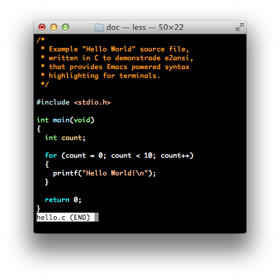

# e2ansi - Syntax highlighting support for `less`, powered by Emacs

*Author:* Anders Lindgren 
*Version:* 0.0.1 
*URL:* [https://github.com/Lindydancer/e2ansi](https://github.com/Lindydancer/e2ansi) 

--------------------

NOTE: This is a very early release of this package. It has only
been made public to gain some additional mileage.

Please submit bug reports and feedback. However, before submitting
the feature suggestions, please read through the "Future
development" section below.

Once I consider this package to be mature enough, I will publish it
on Melpa and announce it to a wider audience.

--------------------

*e2ansi* (Emacs to ANSI) provides syntax highlighting support for
terminal windows.

The `e2ansi-cat` command line tool use ANSI escape sequences to
syntax highlight source files. The actual syntax highlighting is
performed by Emacs, the mother of all text editors, running in
batch mode.

Pager applications like `more` and `less` can be configured to
automatically invoke `e2ansi-cat`, so that all viewed files will be
syntax highlighted. A nice side effect is that any other
conversion, like uncompressing files, is also automatically
applied.

## Example

| Before                     | After                         |
| ------                     | -----                         |
|  |  |

## Syntax

The `e2ansi-cat` command line tool is written in Emacs Lisp. To
start it, use:

    emacs --batch [...Emacs options...] -l bin/e2ansi-cat [...options...]

Alternatively, on UNIX-like operating systems the `e2ansi-cat` can
be executed directly, assuming that the `bin` directory is in the
load path. This assumes that Emacs is installed as `/usr/bin/emacs`:

    e2ansi-cat [...options...]

Note, due to how Emacs parses options, some options passed to
`e2ansi-cat` is parsed by Emacs. Most notably, passing the option
`--help` to `e2ansi-cat` displays help for Emacs itself.

Command line options:

* `--background-mode` -- Specify `light` or `dark` background mode.
* `--colors` -- Number of colors, or `rgb24` for full 24 bit
  colors. This is both used when mapping faces to actual colors and
  to decide the kind of ANSI sequences that is used.
* `--color-class` -- Specify `color` or `grayscale`.
* `--theme` -- Specify the color theme to use.
* `--usage` -- Show help text.

## Integration with `less`

The standard command line tool `less` can be configured to
preprocess any output given to it. `e2ansi-cat` can be used to
generate a syntax highlighted version. This is enabled by setting
the following environment variables, for example, to (using bash
syntax):

    export "LESSOPEN=|emacs --batch -l ~/.emacs -l bin/e2ansi-cat %s"
    export "LESS=-R"
    export "MORE=-R"

The above assumes that your init file is named `.emacs` and located
in your home directory. It also assumes that it adds the location
of the `e2ansi` package to the load path.

## Emacs init files

When using Emacs in batch mode, Emacs reads the system init file
but not the user init file.

If you want to load your personal init file, you can load it using
-l command line option, for example:

    emacs -l ~/.emacs -l bin/e2ansi-cat file ...

To avoid loading the system init file, you can specify the -Q
command line option:

    emacs -Q -l ~/.emacs -l bin/e2ansi-cat file ...

### Adapting your init file to batch mode

As Emacs most often is used in interactive mode there is a risk
that parts of the system or your init file doesn't work in batch
mode.

To exclude something when in batch mode, you can use:

        (unless noninteractive
          .. original code goes here ... )

## Silencing messages

When Emacs is used in batch mode, message are emitted on the
standard error stream. This includes messages emitted when files
are loaded.

On UNIX-like operating systems, the standard error stream can be
redirected to /dev/null, for example:

    emacs --batch -l ~/.emacs -l bin/e2ansi-cat 2> /dev/null

Alternatively, the file `e2ansi-silent` can be loaded. This file
has the advantages that the Usage information of `e2ansi-cat` is
printed (when started without arguments) and that it works on all
operating systems. (If you load it before your init file, you might
need to specify the full path.)

    emacs --batch -l e2ansi-silent -l ~/.emacs -l bin/e2ansi-cat ...

### Silencing messages in `site-start.el`

Normally, the file `site-start.el` is loaded by Emacs before any
file specified on the command line. To silence messages emitted by
this file, you can suppress loading it using -Q, load
`e2ansi-silent` and explicitly load the site-start file:

    emacs --batch -Q -l e2ansi-silent -l ../site-lisp/site-start -l ...

Note: When -Q is used, the `site-lisp` directory is not included in
the load path, the `../site-lisp` part compensate for this.

## Emacs modules

* `e2ansi.el` -- Render a syntax highlighted buffer using ANSI
  escape sequences. This can be used both in normal interactive
  mode and in batch mode.
* `e2ansi-silent.el` -- Load this in batch mode to silence some
  messages from init files.
* `bin/e2ansi-cat` -- The command line tool for converting files in
  batch mode.

## Background

### What is Emacs

Emacs is a the mother of all text editors. It originates from the
1970:s, but is still in active development. It runs under all major
operating systems, including MS-Windows, Mac OS X, and various
UNIX-like systems like Linux. You can use normal windows, run it in
a terminal window (great when working remotely), or use it to run
scripts in batch mode, which is how it is used by the command line
tools provided by this package.

Emacs provides state-of-the-art syntax highlighting.

Why use Emacs to power syntax highlighting in the terminal:

* Emacs has support for a vast range of programming languages and
  other structured text formats.
* Emacs is fast and accurate -- it is designed for interactive use,
  and provides advanced support for ensuring that a source buffer
  is parsed correctly.
* Emacs supports color themes. If you don't like the ones provided,
  and can't find one on internet, you can easily write your own.
* To add syntax highlighting support for other formats can easily be
  done by providing a standard Emacs major mode, where the syntax
  highlighting is provided by Font Lock keywords. You can use
  `font-lock-studio` to debug those keywords, it allows you single
  step match by match and it visualizes matches using a palette of
  background colors.

## ANSI sequences

ANSI sequences, formally known as ISO/IEC 6429, is a system used by
various physical terminals and console programs to, for example,
render colors and text attributes such as bold and italics.

See [Wikipedia](http://en.wikipedia.org/wiki/ANSI_escape_code) for
more information.

### Colors

Both foreground and background colors can be rendred. Note that
faces with the same background as the default face is not rendered
with a background.

Four modes are supported:

* 8 -- The eight basic ANSI colors are supported.
* 16 -- The eight basic colors, plus 8 "bright" colors. These are
  represented as "bold" versions of the above.
* 256 -- Some modern terminal programs support a larger palette.
  This consist of the 16 basic colors, a 6*6*6 color cube plus a
  grayscale.
* 24 bit -- Support for 256*256*256 colors.

Attributes:

* Bold
* Italics
* Underline

## Terminal compatibility

Most terminal or console programs support ANSI sequences to some
extent. There is one notable exception to this, the MS-Windows
cmd.exe console window.

### MS-Windows support

There exists packages that can be used to add ANSI capabilities to
cmd.exe. Also, there are replacement console applications. In
addition, some versions of `less`, like the one provided by the
MSYS project, has (limited) native support for ANSI sequences.

## Operating system notes

### Mac OS X

Mas OS X comes bundled with Emacs. Unfortunately, it's a relatively
old version, 22.1.1. It is fully functional, but it lacks some
features. Most notably, the default face definitions are broken
when 8 colors are used.

You can download a modern version from
[EmacsForOSX](http://emacsforosx.com). Once installed, the path to
the Emacs binary is typically
`/Applications/Emacs.app/Contents/MacOS/Emacs`.

## Gallery

All images are screen captures of `less` running in a terminal
window. White or black backgrounds were used, even though some
themes have other backgrounds, when used inside Emacs.

### Default 8 colors

| Light                        | Dark                        |
| ------                       | -----                       |
|  |  |

### Default 256 colors

| Light                          | Dark                          |
| ------                         | -----                         |
|  |  |

### Grayscale 256 colors

| Light                            | Dark                            |
| ------                           | -----                           |
|  |  |

### Selected themes

The following themes are included in the Emacs distribution.

| Tango                | Tsdh light              |
| ------               | -----                   |
|    |  |

| Adwaita              | Misterioso              |
| ------               | -----                   |
|  |  |

## Future development

This sections consists of things that might or might not appear in
this package in the future.

### More command line tools

More command line tools could make life simpler. For example:

* `e2ansi-exec` -- Run another command line tools and convert all
  arguments (that looks like files) to the corresponding ansi
  format. (To avoid converting files that should not be converted,
  this tool must include knowledge regarding common commands.) One
  problem with this tool is the bizarre way Emacs treats command
  line options -- hence, the entire tool, or parts of it, must be
  written in another script language like Ruby.q
* `e2ansi-tmp` -- Render a syntax highlighted version of a file as
  a temporary file and print the file name. This way a user could
  use the shell backquote syntax to feed syntax highlighted
  versions of a file to a third tool, for example:

        atool `e2ansi-tmp afile.c`

  A technical problem with this tool is that it leaves the
  temporary file behind. Hence, some kind of garbage collection
  mechanism must be put in place.

### Generalization

Much of the code in this package is generic. It could most likely
be used to generate other output formats like Markdown. One idea is
to break out the generic parts to a separate package.

Faster response time:

* By using a resident Emacs process, response time could be greatly
  reduced. Today, a bare-bone Emacs start fast, however, if you use
  a heavy init file (like I do) the startup time goes up
  noticeably.
* Incremental syntax highlighting. Today, the entire buffer is
  syntax highlighted at once, before it is converted to ANSI. By
  only run font-lock on parts of the buffer before printing it, a
  receiving applicaiton like `less` could start faster.

### Miscellaneous

Various things.

* Check how things look when using a dark background, maybe
  something would need to be added to the overrides list.
* Don't use the "brightxxx" color names, they are not used by Emacs
  and it's only confusing.
* Add unit tests for individual parts and full source file tests
  where the entire output is compared against a known ANSI
  representation, as done in my `faceup` package.
* Make the low-level routine print the content, that way it should
  be used directly by the batch commands. The other commands could
  be implemented in terms of it.
* Describe Emacs font specification selection process.
* Better error handling when parsing command line arguments.
* Customization support.
* Optimize ANSI sequences. Today, whenever there is a change, a
  reset is emitted, plus codes to set all properties. However,
  sometimes it would be shorter to simple, say, add underline, and
  without touching the other properties.
* Security issues: Don't allow file local variables, or anything
  else, allow arbitrary elisp code to be evecuted when a file is
  viewed.
* Use floating point numbers when scoring, rather than scaling
  down.
* Promote some of the "list" commands from the "test" package.
* In `e2ansi-markup-to-buffer` move point rather than keeping track
  of the position using variables, this would simplify the code.

---
Converted from `e2ansi.el` by [*el2markdown*](https://github.com/Lindydancer/el2markdown).
